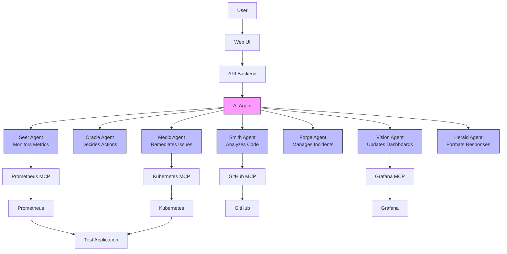
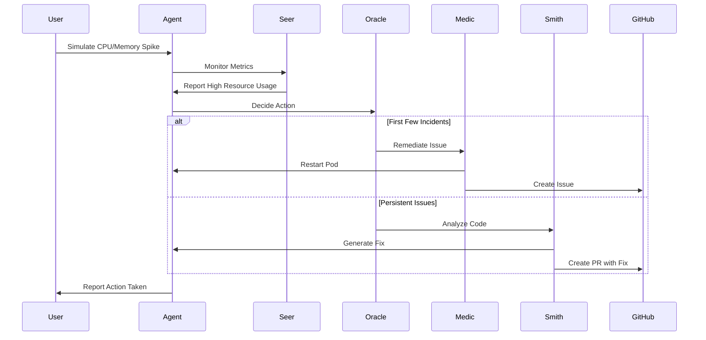

# KubeGuardian: AI Agent for Kubernetes Monitoring and Self-Healing

[](https://www.python.org/)
[](https://www.langchain.com/)
[](https://azure.microsoft.com/en-us/products/ai-services/openai-service)
[](https://kubernetes.io/)
[](https://www.docker.com/)
[](https://prometheus.io/)
[](https://grafana.com/)
[](https://github.com/)

KubeGuardian is an intelligent AI agent system that monitors applications running on Kubernetes, performs health checks, and implements automated fixes. It uses Azure OpenAI to analyze issues, make decisions, and take appropriate actions to maintain system health.


## Features

- 🔍 **Real-time Monitoring**: Continuously monitors CPU and memory usage of Kubernetes pods
- 🚨 **Automatic Issue Detection**: Identifies abnormal resource usage patterns and potential problems
- 🛠️ **Self-Healing**: Automatically restarts pods when issues are detected (up to configurable limits)
- 📊 **Metrics Visualization**: Integrates with Grafana for real-time metrics visualization
- 🔄 **Incident Tracking**: Creates GitHub issues for all detected incidents
- 💡 **Intelligent Analysis**: Uses Azure OpenAI to analyze persistent issues and suggest fixes
- 🛠️ **Automated Fixes**: Creates pull requests with code changes to resolve recurring problems
- 📝 **Comprehensive Logging**: Maintains detailed logs of all actions and decisions
- 🧪 **Issue Simulation**: Allows simulating CPU and memory spikes for testing and demonstration
- 🤖 **Chat Interface**: Provides a web UI for interacting with the agent and monitoring system status

## Architecture

The system consists of the following components:



### Component Breakdown

1. **Test Application**: A simple application that can simulate CPU and memory spikes
2. **Monitoring Stack**: Prometheus and Grafana for metrics collection and visualization
3. **MCP Servers**: Model Context Protocol servers for Kubernetes, Prometheus, Grafana, and GitHub
4. **AI Agent**: LangGraph-based agent using Azure OpenAI for decision making
5. **Chat Interface**: Web UI for interacting with the agent and simulating issues

### Agent Workflow



## Setup Instructions

### Prerequisites

- Docker and Docker Compose
- Python 3.9+
- Azure OpenAI API key
- GitHub API token

### Installation

1. Clone the repository:
   ```bash
   git clone https://github.com/yourusername/kubeguardian.git
   cd kubeguardian
   ```

2. Create a `.env` file with your API keys:
   ```
   # Azure OpenAI Configuration
   AZURE_OPENAI_API_KEY=your_azure_openai_api_key
   AZURE_OPENAI_ENDPOINT=your_azure_openai_endpoint
   AZURE_OPENAI_DEPLOYMENT=your_azure_openai_deployment
   AZURE_OPENAI_API_VERSION=your_azure_openai_api_version

   # GitHub API Token
   GITHUB_TOKEN=your_github_token
   GITHUB_OWNER=your_github_username
   GITHUB_REPO=your_github_repo
   ```

3. Install dependencies:
   ```bash
   pip install -r requirements.txt
   ```

4. Start the local environment:
   ```bash
   docker-compose up -d
   ```

5. Access the chat interface:
   ```
   http://localhost:8080
   ```

## Usage

### Web Interface

The web interface provides several ways to interact with the system:

1. **Chat**: Ask questions about the system or request actions
2. **Simulate Issues**: Create CPU or memory spikes to test the agent's response
3. **View Incidents**: See a history of detected issues and actions taken
4. **Monitor Metrics**: View real-time metrics in Grafana dashboards

### Common Commands

Through the chat interface, you can use commands like:

- "Simulate a CPU spike"
- "Simulate a memory spike"
- "Show me recent incidents"
- "How many pod restarts today?"
- "What's the status of the services?"
- "Restart the pod please"

## Directory Structure

```
.
├── README.md
├── docker-compose.yml
├── requirements.txt
└── src/
    ├── agent/                  # AI agent implementation using LangGraph
    │   ├── agent.py            # Main agent workflow
    │   ├── api.py              # Agent API endpoints
    │   ├── incident_store.py   # Incident tracking
    │   ├── mcp_client.py       # MCP client for tool use
    │   └── sub_agents/         # Specialized agent components
    │       ├── forge.py        # Incident management
    │       ├── herald.py       # Response formatting
    │       ├── logger.py       # Logging utilities
    │       ├── medic.py        # Issue remediation
    │       ├── oracle.py       # Decision making
    │       ├── seer.py         # Metrics monitoring
    │       ├── smith.py        # Code analysis
    │       └── vision.py       # Dashboard management
    ├── api/                    # FastAPI backend for the chat interface
    ├── kubernetes/             # Kubernetes configuration files
    ├── mcp/                    # MCP server implementations
    │   ├── github/             # GitHub MCP server
    │   ├── grafana/            # Grafana MCP server
    │   ├── kubernetes/         # Kubernetes MCP server
    │   └── prometheus/         # Prometheus MCP server
    ├── monitoring/             # Prometheus and Grafana configuration
    │   ├── grafana/            # Grafana dashboards and datasources
    │   └── prometheus/         # Prometheus configuration
    └── ui/                     # Web UI for the chat interface
        ├── public/             # Static assets
        └── server.js           # Express server for UI
```

## Local Development

### Development Workflow

1. Start the services in development mode:
   ```bash
   docker-compose up -d
   ```

2. Make changes to the code

3. Restart the affected services:
   ```bash
   docker-compose restart agent ui
   ```

4. For UI development, you can use the browser's developer tools to debug

5. For agent development, check the logs:
   ```bash
   docker-compose logs -f agent
   ```

### Testing

You can test the system by:

1. Simulating CPU/memory spikes through the UI
2. Monitoring the agent's response in the logs
3. Checking GitHub for created issues
4. Viewing metrics in Grafana (http://localhost:3000)

## Advanced Configuration

### Environment Variables

The system can be configured through environment variables in the `.env` file:

- `MAX_RESTARTS_PER_DAY`: Maximum number of pod restarts per day (default: 10)
- `ANALYSIS_THRESHOLD`: Number of restarts before code analysis (default: 4)
- `PROMETHEUS_SCRAPE_INTERVAL`: Prometheus scrape interval (default: 15s)
- `GRAFANA_ADMIN_PASSWORD`: Grafana admin password (default: admin)

### Custom Dashboards

You can create custom Grafana dashboards by adding JSON files to `src/monitoring/grafana/dashboards/`.

### Adding New MCP Servers

To add a new MCP server:

1. Create a new directory in `src/mcp/`
2. Implement the server following the MCP protocol
3. Add the server to `docker-compose.yml`
4. Update the agent to use the new server

## Contributing

Contributions are welcome! Please feel free to submit a Pull Request.

1. Fork the repository
2. Create your feature branch (`git checkout -b feature/amazing-feature`)
3. Commit your changes (`git commit -m 'Add some amazing feature'`)
4. Push to the branch (`git push origin feature/amazing-feature`)
5. Open a Pull Request

## License

This project is licensed under the MIT License - see the LICENSE file for details.

## Acknowledgments

- [LangChain](https://www.langchain.com/) for the agent framework
- [Azure OpenAI](https://azure.microsoft.com/en-us/products/ai-services/openai-service) for the language model
- [Model Context Protocol](https://github.com/modelcontextprotocol/mcp) for the tool use framework
