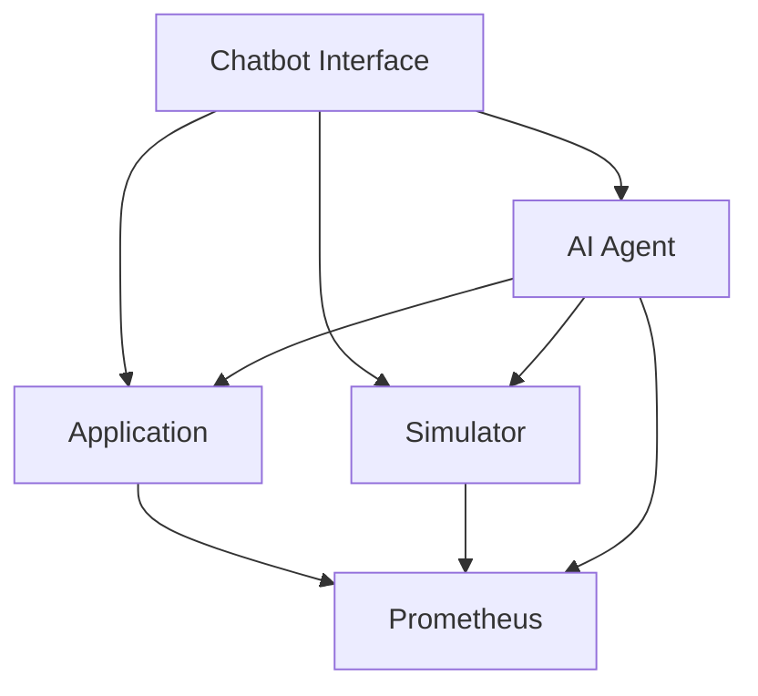

# AI Agent System for Application Monitoring

This system demonstrates an AI agent that monitors application health and takes automated remedial actions. It includes:

- A sample application that exposes health metrics
- A simulator to generate CPU and memory load
- An AI agent that monitors and fixes issues
- A chatbot interface for user interaction

## Components

1. **Application** (Port 5000, Metrics: 8080)
   - Sample Flask application
   - Exposes health metrics via Prometheus
   - Provides admin endpoints for metric manipulation

2. **Simulator** (Port 5002, Metrics: 8080)
   - Generates CPU and memory load
   - Exposes metrics via Prometheus
   - Controlled through REST API

3. **AI Agent** (Port 5003)
   - Monitors application health
   - Takes automated remedial actions
   - Creates GitHub issues for persistent problems
   - Adds Grafana annotations for actions taken

4. **Chatbot Interface** (Port 8000)
   - Web interface for user interaction
   - Query system status and metrics
   - Trigger simulations and fixes
   - View incident history

## Prerequisites

- Python 3.12 or higher
- tmux (for running multiple components)
- pip (Python package manager)

## Setup

1. Clone the repository:
   ```bash
   git clone <repository-url>
   cd <repository-name>
   ```

2. Create and activate virtual environment:
   ```bash
   python -m venv venv
   source venv/bin/activate  # On Windows: venv\Scripts\activate
   ```

3. Install dependencies:
   ```bash
   pip install -r requirements.txt
   ```

4. Configure environment variables:
   ```bash
   cp .env.example .env
   # Edit .env with your settings
   ```

## Running the System

1. Make the setup script executable:
   ```bash
   chmod +x scripts/setup_local.sh
   ```

2. Run the setup script:
   ```bash
   ./scripts/setup_local.sh
   ```

This will start all components in separate tmux panes.

## Testing the System

1. Open the chatbot interface:
   ```
   http://localhost:8000
   ```

2. Open the admin interface:
   ```
   http://localhost:8000/admin
   ```

3. Test scenarios:

   a. Simulate high CPU usage:
   - Use the admin interface to set CPU load to 90%
   - Watch the AI agent detect and fix the issue

   b. Simulate high memory usage:
   - Use the admin interface to set memory usage to 100MB
   - Watch the AI agent detect and fix the issue

   c. Chat interface:
   - Ask about system status
   - Request metrics
   - Trigger simulations
   - View incident history

## Component URLs

- Application: http://localhost:5000
  - Health: http://localhost:5000/health
  - Metrics: http://localhost:8080/metrics

- Simulator: http://localhost:5002
  - Metrics: http://localhost:8080/metrics

- AI Agent: http://localhost:5003
  - Health: http://localhost:5003/health
  - Incidents: http://localhost:5003/incidents
  - Restarts: http://localhost:5003/restarts

- Chatbot Interface: http://localhost:8000
  - Admin: http://localhost:8000/admin

## Architecture



## Metrics

The system exposes the following metrics:

- `app_cpu_usage`: Application CPU usage (0-1)
- `app_memory_usage`: Application memory usage (MB)
- `app_health_status`: Application health status (0=unhealthy, 1=healthy)
- `app_request_count`: Total request count
- `simulator_cpu_usage`: Simulated CPU usage (0-1)
- `simulator_memory_usage`: Simulated memory usage (MB)

## Contributing

1. Fork the repository
2. Create your feature branch
3. Commit your changes
4. Push to the branch
5. Create a new Pull Request
